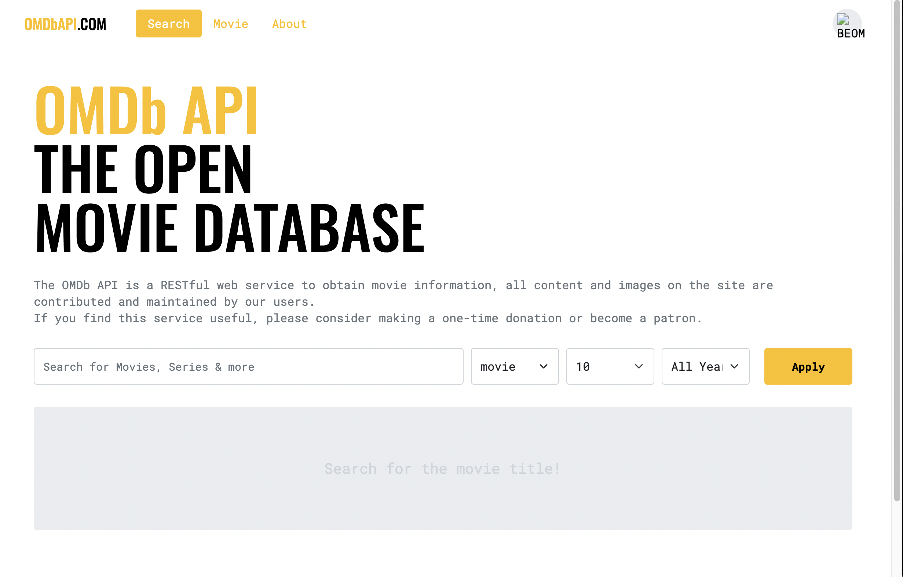
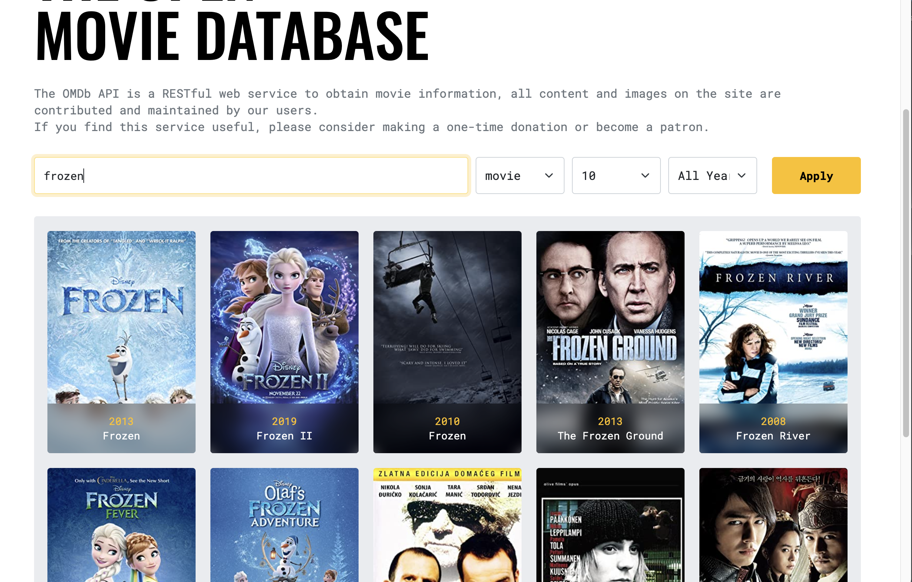
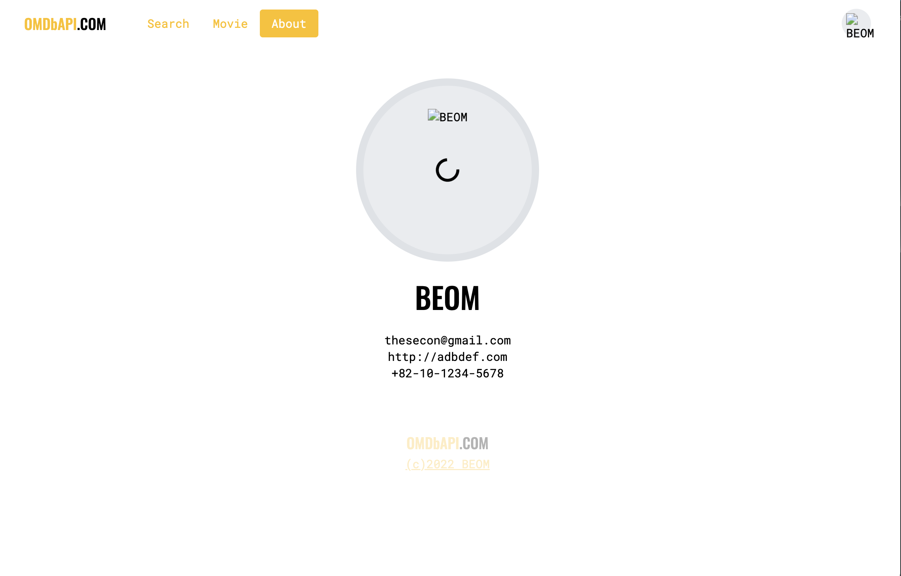

# MovieSearchSite

- 앱 설명
  - 영화를 검색하여 정보를 얻을 수 있는 웹사이트 개발
- 사용 Skills
  - JavaScript, Vue, Jest, Netlify
- 기능 구현
  - 영화 검색 API 연동
  - 검색페이지, 카드형 영화 목록 페이지, 영화별 상세페이지 구현
  - Jest를 활용한 Test 코드 적용
  - Netlify를 활용한 배포 (https://musing-colden-4d0a39.netlify.app)
- 성장한 부분
  - Vue에 대한 기본적인 기능 학습, Jest를 통한 TDD 경험

< Main UI >

< 영화 Search UI >

< 영화 정보 UI >

< About UI >

